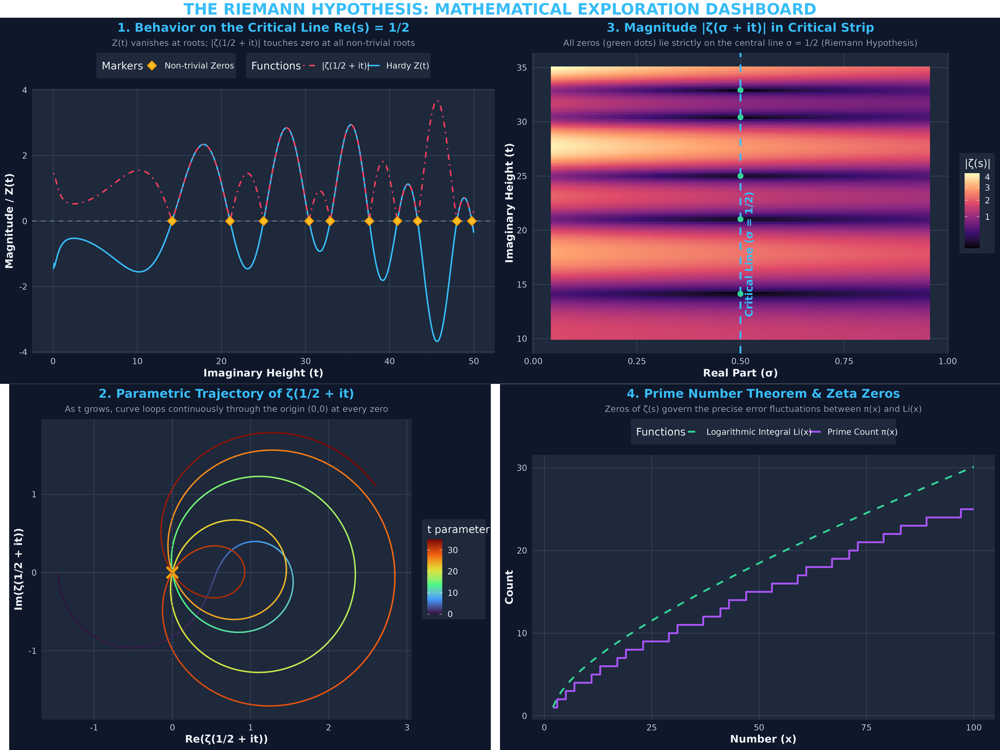
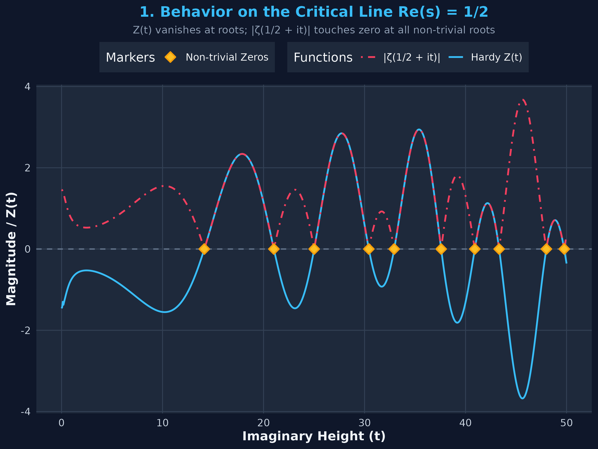
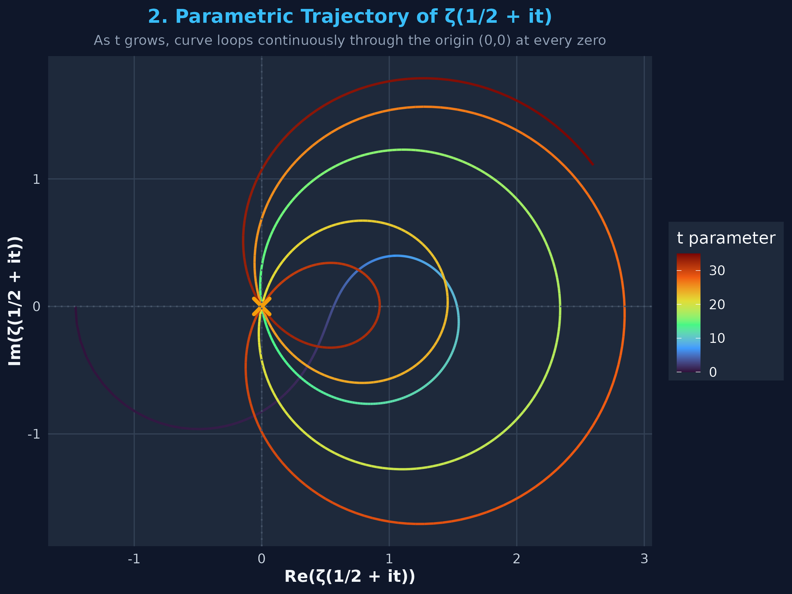
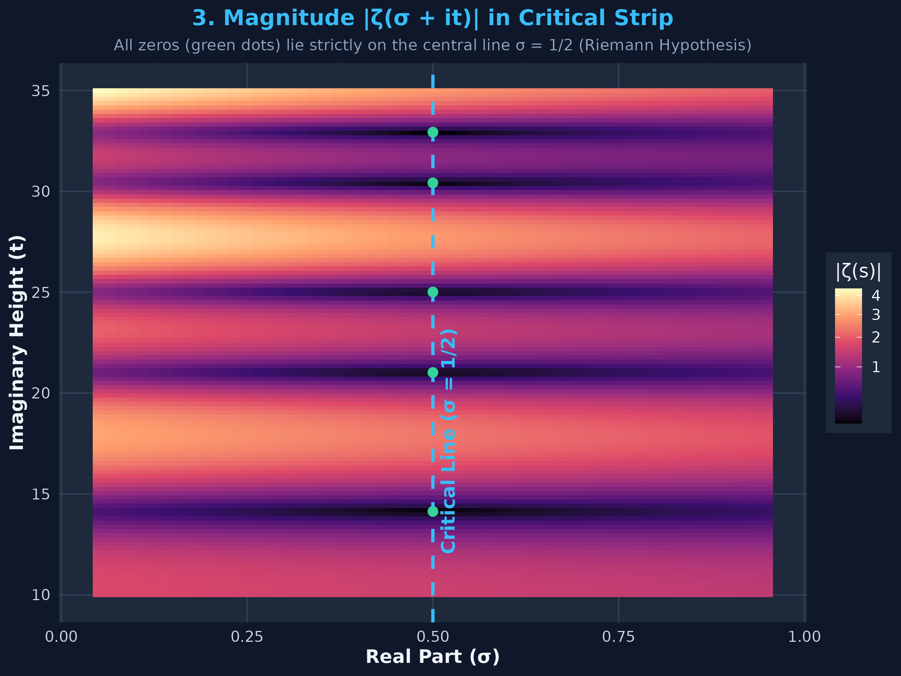
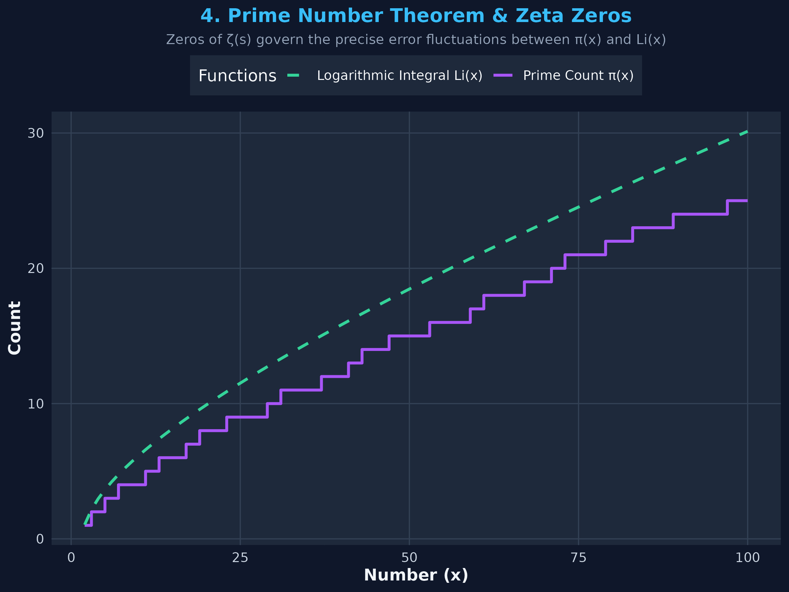

# The Riemann Hypothesis: Mathematical Exploration & R Visualization

The **Riemann Hypothesis**, proposed by Bernhard Riemann in 1859, is one of the most fundamental unsolved problems in mathematics and a Millennium Prize Problem. It asserts that all non-trivial zeros of the Riemann Zeta Function $\zeta(s)$ lie on the **critical line**:

$$\text{Re}(s) = \frac{1}{2}$$

---

## 📊 Complete Dashboard

Below is the composite visualization dashboard generated by running `riemann_hypothesis.R`:



---

## 🔍 Visualizations Breakdown

### 1. Behavior on the Critical Line $\text{Re}(s) = 1/2$


- **Hardy’s $Z$-function**: $Z(t) = e^{i \theta(t)} \zeta\left(\frac{1}{2} + it\right)$ is a real-valued function of a real variable $t$.
- **Zeros**: $Z(t) = 0$ precisely when $\zeta\left(\frac{1}{2} + it\right) = 0$.
- **First Non-trivial Zeros**:
  - $t_1 \approx 14.1347$
  - $t_2 \approx 21.0220$
  - $t_3 \approx 25.0109$
  - $t_4 \approx 30.4249$
  - $t_5 \approx 32.9351$
- The modulus $|\zeta(1/2 + it)|$ touches zero at each yellow diamond marker.

---

### 2. Parametric Trajectory in the Complex Plane


- Plots $x(t) = \text{Re}\left(\zeta\left(\frac{1}{2} + it\right)\right)$ versus $y(t) = \text{Im}\left(\zeta\left(\frac{1}{2} + it\right)\right)$ as $t$ increases from $0$ to $35$.
- As $t$ evolves, the curve loops continuously through the origin $(0,0)$ at every non-trivial zero.

---

### 3. Magnitude Landscape $|\zeta(\sigma + it)|$ Across the Critical Strip ($0 < \sigma < 1$)


- Heatmap grid over $\sigma \in [0.05, 0.95]$ and $t \in [10, 35]$.
- Shows the "valleys" of the function magnitude. The green dots indicate the non-trivial zeros lying strictly along the central axis $\sigma = 0.5$.

---

### 4. Connection to Prime Numbers: $\pi(x)$ vs $\text{Li}(x)$


- The prime counting function $\pi(x)$ counts primes $\le x$.
- According to Riemann's explicit formula, the error term $|\pi(x) - \text{Li}(x)|$ is bounded by:

$$|\pi(x) - \text{Li}(x)| = O(\sqrt{x} \ln x)$$

if and only if the Riemann Hypothesis is true.

---

## 🛠️ Code & Execution

- **R Script**: [riemann_hypothesis.R](./riemann_hypothesis.R)
- **Numerical Method**: Implemented **Borwein’s accelerated algorithm (1995)** for Dirichlet's $\eta(s)$ function:
  $$\zeta(s) = \frac{1}{1 - 2^{1-s}} \sum_{k=1}^N \frac{(-1)^{k-1} e_k}{k^s}$$
- **Run Command**:
  ```bash
  Rscript riemann_hypothesis.R
  ```
